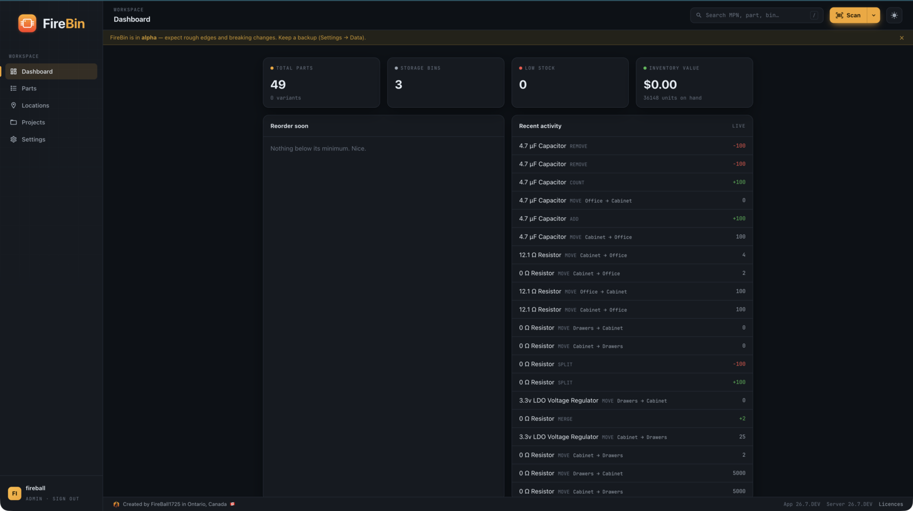
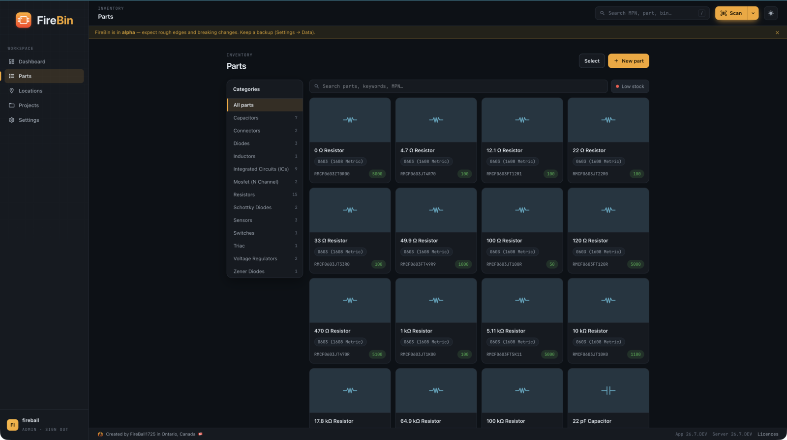
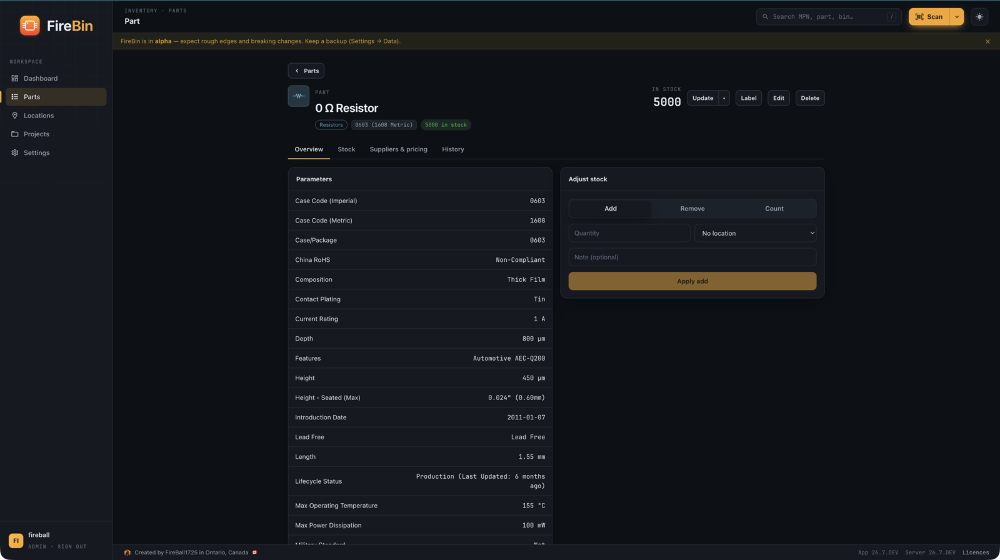
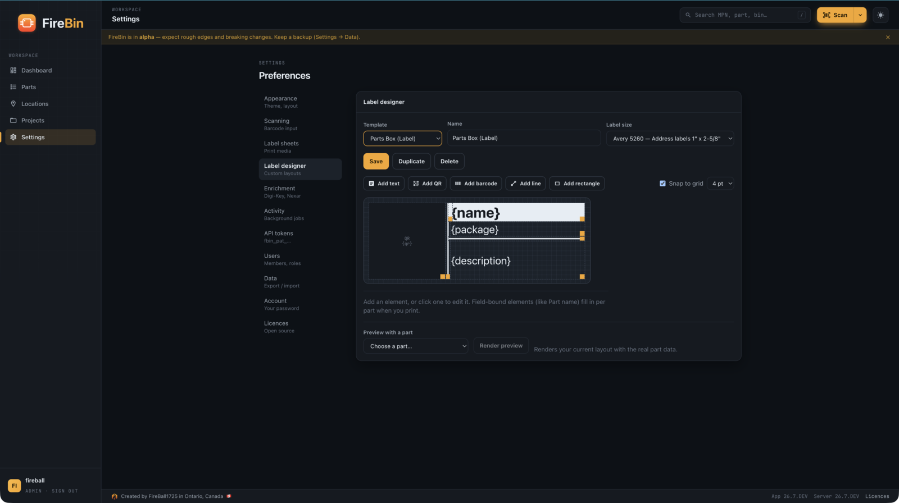

<p align="center">
  
</p>
<h1 align="center">firebin-web</h1>
<p align="center">
  The <a href="https://github.com/FireBall1725/firebin">FireBin</a> web client, a self-hosted electronics parts inventory.
</p>
<p align="center">
  <a href="https://github.com/FireBall1725/firebin">Umbrella</a> ·
  <a href="https://github.com/FireBall1725/firebin-api">API</a> ·
  <a href="https://fireball1725.github.io/firebin-api/">API reference</a>
</p>

---

React 19, TypeScript, Vite 8, and Tailwind 4. It talks to `firebin-api` over REST at `/api/v1` and holds no data of its own; every part, bin, and price comes from the API.

Browse and group parts by name and variant, adjust stock at a location, scan a distributor barcode with the camera or a USB wedge, cut a reel into a barcoded mini spool, and design and print bin, part, and lot labels (including Brother P-touch tape over WebUSB). This repo is one of three: `firebin-web` (here), [`firebin-api`](https://github.com/FireBall1725/firebin-api) (the Go backend), and [`firebin`](https://github.com/FireBall1725/firebin) (compose files and self-host docs).

FireBin is in alpha.

## Screenshots

<table>
  <tr>
    <td width="50%"><br/><sub><b>Dashboard</b></sub></td>
    <td width="50%"><br/><sub><b>Parts</b>, grouped and colour-coded</sub></td>
  </tr>
  <tr>
    <td><br/><sub><b>Part detail</b> with stock adjust</sub></td>
    <td><br/><sub><b>Label designer</b></sub></td>
  </tr>
</table>

## Run it for development

You need the API running first (see the `firebin-api` repo, or the local stack in `firebin`). Then:

```sh
npm ci
npm run dev
```

Vite serves the app on `http://localhost:5173` and proxies `/api` to `http://localhost:8080`. Point it at a different backend with `VITE_API_PROXY_TARGET`:

```sh
VITE_API_PROXY_TARGET=https://firebin.example.com npm run dev
```

The proxy keeps the `/api/events` server-sent-events stream open (idle timeout disabled), which is how every view refreshes itself when another user changes stock.

## Build

```sh
npm run build     # tsc -b, then vite build → dist/
npm run lint      # oxlint
```

`npm run build` type-checks with the TypeScript project references before it bundles, so a type error fails the build rather than shipping. Set `FIREBIN_VERSION` at build time to stamp the release into the About screen:

```sh
FIREBIN_VERSION=26.7.0 npm run build
```

CI runs `npm ci`, `tsc -b`, `oxlint`, and `vite build` on every push and pull request. A tagged release (`vYY.M.rev`) builds the container (nginx serving the bundle on port 3000, proxying `/api` to `firebin-api:8080`) and pushes it to `ghcr.io/fireball1725/firebin-web`.

## Notes for the browser

The camera scanner and the WebUSB label printer only run on a secure origin, so they work on `localhost` and over HTTPS, and stay disabled over a plain LAN IP. Data Matrix decoding uses zxing-wasm; the plain `@zxing/library` build can't read Data Matrix. Icons are MDI (`@mdi/js`, Apache-2.0).

## Contributing

See [CLAUDE.md](CLAUDE.md) for the architecture, the conventions, and the checks a pull request has to pass. To deploy FireBin rather than work on it, start from the [`firebin`](https://github.com/FireBall1725/firebin) repo.

## Licence

AGPL-3.0-only. See [LICENSE](LICENSE).

---

<p align="center">
  <a href="https://fireball1725.ca"></a>
</p>
<p align="center">Built by <a href="https://fireball1725.ca">FireBall1725</a> in Ontario, Canada 🇨🇦</p>
